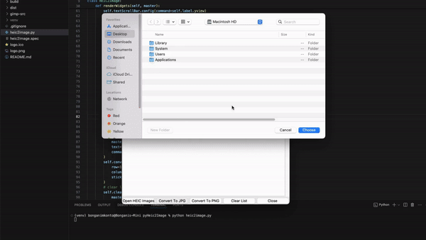

# React Site for Heic2Image 

* This app is written in Python and converts .heic image file formats to jpg/png
* <a>Heic2Image App</a>
* Download the .zip file and start converting multiple images at once

